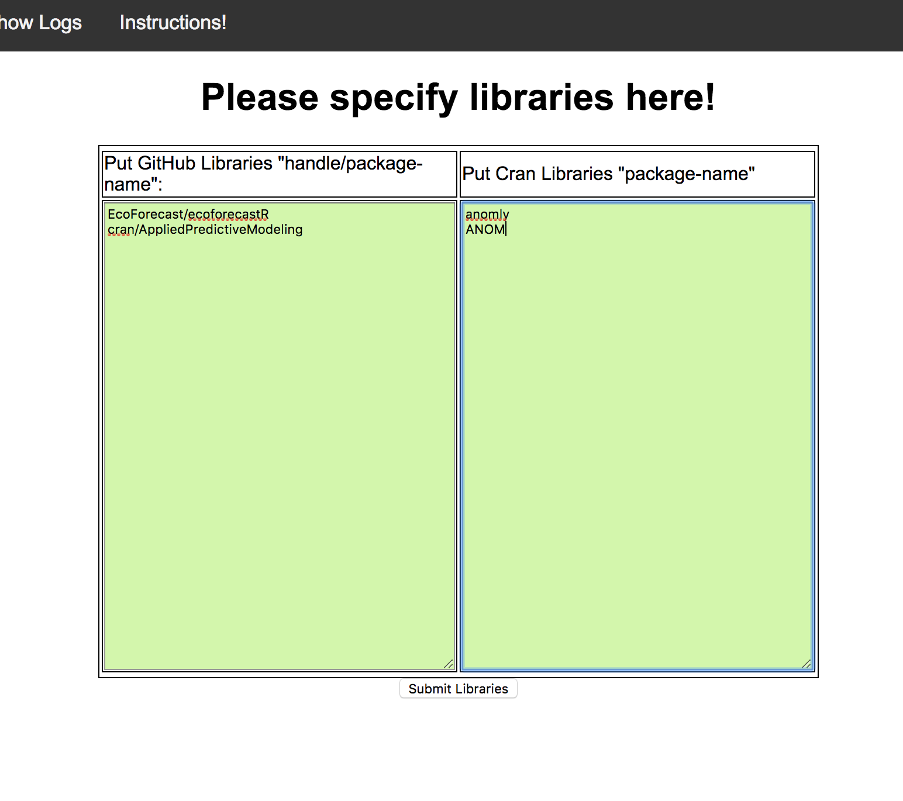
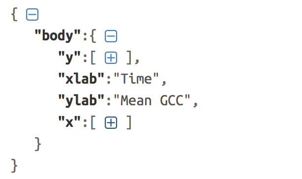
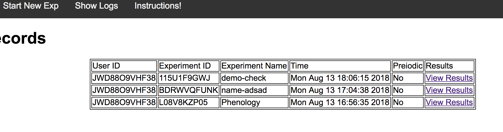

# Ecoforecast

## How to Run Code on Web
1. Go to the page (http://csr.bu.edu/rina/EcoForecast) and login with username and password (for now you don't need to enter password, just your email id as username). One can use files in 'demo/' folder to recreate the following results.

2. Click on "Run New Experiment"

3. This will take you to the next page, where you can add all the required libraries. We have already install basic R libraries but if any new library is required user should enter it here. One library name on each line as shown below.

Note: Large packages will cause a timeout currently, we are working on a solution. All libraries needed to run the EcoForecast code are included by default though, including runjags, devtools, jsonlite, and all other dependencies needed for the EcoForecast/ecoforecastR package.

4. After this users can submit their code on the next page. They can also specify the periodic intervals if they want to re-execute the same code again. They should also submit any files their code might require (all files should be zipped in one file, these files are unpacked in '/action/' directory, so incase your code is using these files you can use the path '/action/filename').

### The output of R code, should be written in json format to a file called 'out.json'. Incase user want to use our online plotting tool they should put those variables in json "body".

Above screenshot shows a sample code that runs every hour (untill the specified date) and uses the supporting files.

Output json file should look like the following.

5.After submitting code, user will be redirected to the logs page where they can see the all the old results. On completion of each code execution the results will appear here. 

6. User can view/download any result by clicking on view results.

