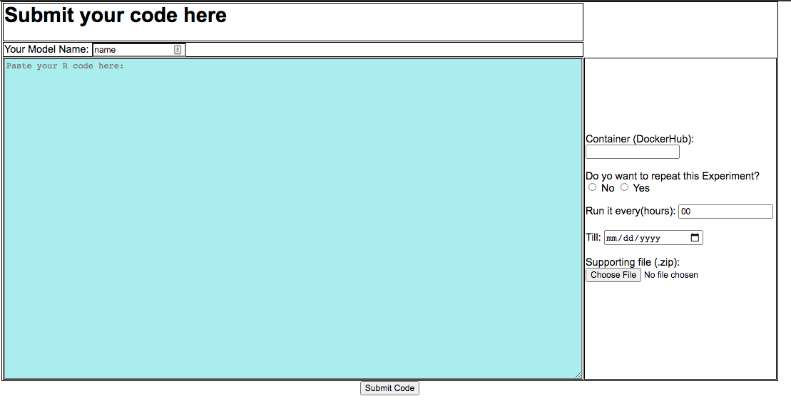
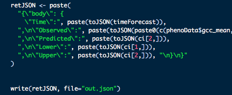

# Ecoforecast User Manual

## How to Run R-code using our Web-based Platform
1. Go to the page (http://ecoforecast.bu.edu) and login with username and password. (Note: One can use the files under the 'demo/' folder to recreate the following results.)

2. Click on "Run New Experiment"

3. This will take you to the next page - **This page and ability to add libraries is currently down- users must upload Docker images***

4. On the next page, the user can submit their code on the next page. The user can input containers they want to use with required packages here. If the user does not have a specifc container, they can use **'alexfarra/ecoforecastdocker:WithLibraries'**. This image has rjags, runjags, ecoforecastR, and other basic packages. Directions to creating a Docker image can be found **[here](https://github.com/akhtarnabeel/ecoforecastCS/blob/master/CreateContainer.md)**. Users can also specify the periodic interval if they wants to re-execute the same code repeatedly. The user should submit any files their code might require; in this case, all files should be zipped in one file, which get unpacked under the '/action/' directory, so in case your code is using these files, you can refer to them using the path '/action/filename'). 

#### The output of your R code should be written in json format to a file called 'out.json'. If the user wants to use our online plotting tool, they should put those variables and associated values in the json "body". The output json file should look like the following. The JSON headers must be exact for the results to work with the **[forecasting dashboard](http://ecoforecast.bu.edu:3838/NEFI/)**

5. After submitting the code, the user will be redirected to the logs page where they can see all the old results. Upon the completion of each code execution, the results appear here. 

6. The user can view/download any result by clicking on 'view results'.

7. The user can view graphs of their results and other forecasts on the **[forecasting dashboard](http://ecoforecast.bu.edu:3838/NEFI/)**
