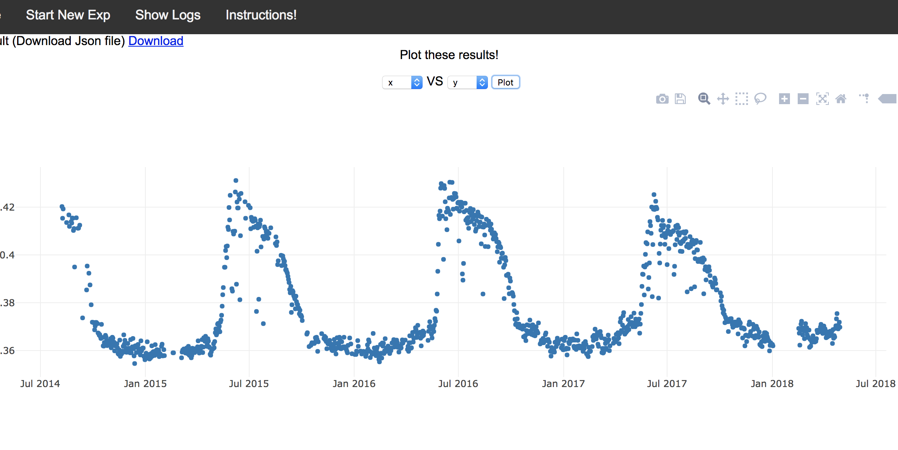

# Ecoforecast User Manual

## How to Run R-code using our Web-based Platform
1. Go to the page (http://csr.bu.edu/rina/EcoForecast) and login with username and password (for now you don't need to enter a password, just your email id as username). (Note: One can use the files under the 'demo/' folder to recreate the following results.)

2. Click on "Run New Experiment"

3. This will take you to the next page, where you can add all the required libraries. We have already install basic R libraries, but if any new library is required, the user should enter it here -- one library name on each line as shown below.

Note: Large packages will currently cause a timeout -- we are working on a solution. All libraries needed to run the EcoForecast code are included by default though, including runjags, devtools, jsonlite, and all other dependencies needed for the EcoForecast/ecoforecastR package.

4. After this, the user can submit their code on the next page. She can also specify the periodic interval if she wants to re-execute the same code periodically. The user should also submit any files her code might require; in this case, all files should be zipped in one file, which get unpacked under the '/action/' directory, so in case your code is using these files, you can refer to them using the path '/action/filename').

### The output of your R code should be written in json format to a file called 'out.json'. If the user wants to use our online plotting tool, she should put those variables and associated values in the json "body".

The above screenshot shows a sample code that runs every hour (until the specified date) and uses the supporting files.

The output json file should look like the following.

5. After submitting the code, the user will be redirected to the logs page where she can see all the old results. Upon the completion of each code execution, the results appear here. 

6. The user can view/download any result by clicking on 'view results'.

